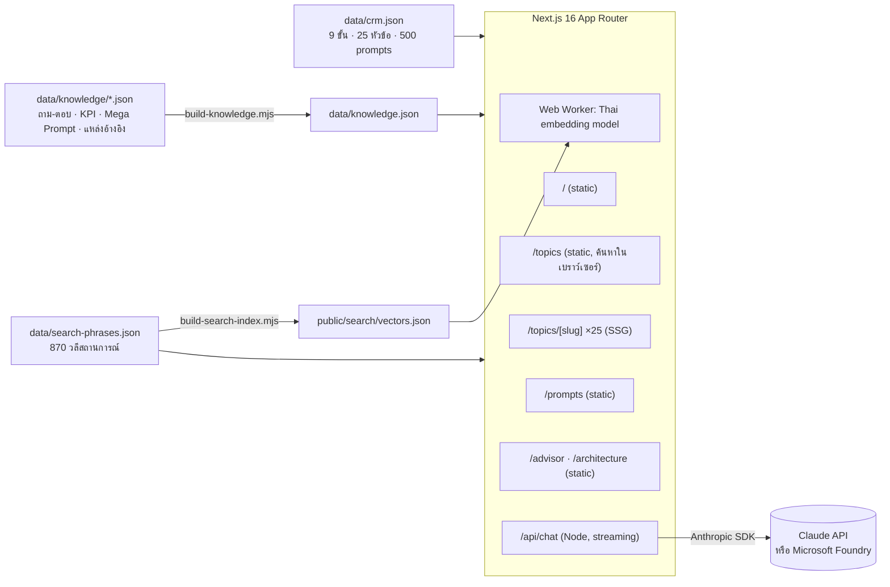

# แผนที่ CRM
### CRM Knowledge Hub + 500 Prompts + AI Advisor

> **CRM ไม่ใช่ซอฟต์แวร์ แต่คือวิธีที่ธุรกิจ "เข้าใจลูกค้าให้ลึกที่สุด"**

เว็บไซต์สำหรับเรียนรู้และ**นำ CRM ไปใช้จริง** จัด 31 หัวข้อตาม *วงจรชีวิตลูกค้า 9 ขั้น* (ไม่ใช่ตามฟีเจอร์ซอฟต์แวร์) ทุกหัวข้ออธิบายแบบ**ถาม-ตอบ** มี KPI ขั้นตอนลงมือทำ ข้อผิดพลาดที่พบบ่อย และ **Prompt ต่อยอด** ให้คัดลอกไปใช้กับ AI ได้ทันที พร้อม**ที่ปรึกษา AI** ที่รู้จักทุกหัวข้อในเว็บ

หัวข้อที่ 1–25 และ prompt 500 รายการแรก เรียบเรียงจาก [500 CRM Prompts Book (Thai Version)](https://github.com/ppongsakorn/prompts-book-template-thai/blob/main/crm-prompts-books-template.md) โดย Buzzebees · อีก 6 หัวข้อเพิ่มใหม่จากการค้นคว้าปี 2026 · โครงสร้างเว็บต่อยอดจาก [เข็มทิศกรอบความคิด](https://github.com/ppongsakorn/management-framework)

---

## สารบัญ

- [ทำไมต้องมีเว็บนี้](#ทำไมต้องมีเว็บนี้)
- [ฟีเจอร์](#ฟีเจอร์)
- [หัวข้อทั้ง 31](#หัวข้อทั้ง-31)
- [ที่ปรึกษา AI ทำงานอย่างไร](#ที่ปรึกษา-ai-ทำงานอย่างไร)
- [สถาปัตยกรรม](#สถาปัตยกรรม)
- [เริ่มใช้งาน](#เริ่มใช้งาน)
- [ตัวแปร Environment](#ตัวแปร-environment)
- [Deploy แบบ static บน GitHub Pages](#deploy-แบบ-static-บน-github-pages)
- [Deploy บน Azure (รวมที่ปรึกษา AI)](#deploy-บน-azure-รวมที่ปรึกษา-ai)
- [เพิ่มหรือแก้ไขเนื้อหา](#เพิ่มหรือแก้ไขเนื้อหา)
- [ลิขสิทธิ์และเครดิต](#ลิขสิทธิ์และเครดิต)

---

## ทำไมต้องมีเว็บนี้

หนังสือ prompt ให้ "คำสั่ง" แต่คนที่จะใช้ prompt ให้ได้ผลต้องเข้าใจ "เรื่อง" ก่อน เว็บนี้จึงเติมชั้นความรู้ลงไปบน prompt ทุกหัวข้อ และจัดเรียงตามเส้นทางของลูกค้า เพื่อให้เริ่มจากจุดที่ทีมติดอยู่จริง:

```
        A. ดึงดูด ──▶ B. เปิดใช้งาน ──▶ C. สื่อสาร ──▶ D. ขยายมูลค่า
        ▲                                                   │
        │                                                   ▼
        H. รับฟัง ◀── G. รักษา ◀── F. คาดการณ์ ◀── E. วัดผล
        └──────────── I. ข้อมูล & ระบบ (ฐานรากของทุกขั้น) ──────────┘
```

| ถ้าทีมของคุณกำลังพูดว่า… | ไปที่ขั้น |
|---|---|
| "ลูกค้าใหม่น้อยลง ไม่รู้จะหา Lead จากไหน" | A. ดึงดูด & ระบุลูกค้า |
| "ได้ลูกค้ามาแล้วแต่ไม่ใช้งานต่อ และยังไม่รู้ว่าลูกค้าเป็นใคร" | B. เปิดใช้งาน & ทำความเข้าใจลูกค้า |
| "ส่งข้อความไปแล้วไม่มีใครเปิด แคมเปญไม่เวิร์ก" | C. สื่อสาร & เสนอคุณค่า |
| "ยอดต่อหัวไม่โต ลูกค้าซื้อแค่ครั้งเดียว" | D. ขยายมูลค่า |
| "ไม่รู้ว่าลูกค้าพอใจจริงไหม รู้อีกทีตอนเขาหายไป" | E. วัดผลประสบการณ์ลูกค้า |
| "ลูกค้าหายไปเงียบ ๆ โดยไม่รู้ตัวล่วงหน้า" | F. คาดการณ์ & ป้องกันการสูญเสีย |
| "สมาชิกไม่ต่ออายุ โปรแกรม Loyalty ไม่ได้ผล" | G. รักษา & ต่ออายุความสัมพันธ์ |
| "ข้อร้องเรียนเยอะ แก้ไม่ทัน และไม่มีใครเอาไปปรับปรุง" | H. รับฟัง & ปรับปรุง |
| "ข้อมูลลูกค้ากระจัดกระจาย เชื่อถือไม่ได้ ทีมทำงานไม่ประสานกัน" | I. พื้นฐานข้อมูลและระบบ |

---

## ฟีเจอร์

### 📚 เรียนรู้
- **วงแหวนวงจรชีวิตลูกค้า** หน้าแรก แตะขั้นไหนก็ไปขั้นนั้น
- **ค้นหาด้วย AI ในเบราว์เซอร์** พิมพ์สถานการณ์ เช่น "คนซื้อแล้วไม่กลับมาอีกเลย" แล้วได้หัวข้อที่ใช่ ทำงาน 3 ชั้น (ค้นคำแบบตัดคำไทย + BM25 · คลังวลีสถานการณ์ราว 1,300 วลี · ค้นตามความหมายด้วยโมเดล embedding ภาษาไทยที่รันในเบราว์เซอร์) รวมอันดับด้วย RRF ไม่ส่งข้อความไป server — ชุดทดสอบ 162 คำค้น ได้หัวข้อที่ถูกใน 3 อันดับแรก 96%
- **หน้าหัวข้อ** ประกอบด้วย: สรุปสั้น · ศัพท์ที่ต้องรู้ · **ถาม-ตอบ 8–12 ข้อ** (ทุกข้อมี Prompt ต่อยอด) · KPI พร้อมสูตรและค่าอ้างอิง · ขั้นตอนลงมือทำ · ข้อผิดพลาดที่พบบ่อย · **Mega Prompt** · Prompt 20 รายการจากหนังสือ · บริบทตลาดไทย · สิ่งที่ทีมข้อมูลต้องเตรียม · แหล่งอ้างอิง

### ✂️ Prompt
- **หน้า `/prompts`** ค้นหาและคัดลอก prompt ทั้ง 500 รายการ กรองตามขั้นได้
- ทุก prompt ไฮไลต์ `[ช่องว่าง]` ที่ต้องเติม และมีปุ่มคัดลอก

### 🤖 ที่ปรึกษา AI (โหมด server)
- **หน้า `/advisor`** เล่าสถานการณ์ แล้ว AI จะวินิจฉัยว่าอยู่ขั้นไหน แนะนำหัวข้อไม่เกิน 3 หัวข้อ พร้อมลิงก์และ Prompt ต่อยอดที่ปรับเข้ากับธุรกิจคุณ
- **AI ประจำแต่ละหน้าหัวข้อ** ช่วยปรับความรู้ให้เข้ากับบริบท เขียน prompt ที่ดีกว่า หรือบอกว่าทีมข้อมูลต้องเตรียมอะไร
- ตอบเป็นภาษาไทย streaming รองรับตาราง markdown

### 🆕 อัปเดตปี 2026
- ทุกหัวข้อค้นคว้ารอบสองเมื่อ ต.ค. 2026: ตรวจข้อเท็จจริงใหม่ ปรับภาษาให้อ่านง่าย และเพิ่มส่วน **"อะไรเปลี่ยนไปในปี 2025–2026"** (AI, Social Media, Marketplace, Live Commerce, แชท, กฎหมาย, Loyalty, ข้อมูล) พร้อมแหล่งอ้างอิง
- **หน้า `/trends`** รวมการเปลี่ยนแปลงทั้งหมดตามธีม (มือถือที่ `/mobile/trends`)
- ข้อมูลอยู่ใน `whatsNew` และ `updatedAt` ของ `data/knowledge/<slug>.json` · หัวข้อใหม่มี `"source": "2026"` ใน `data/crm.json`

### 🔌 WebMCP
ทุกหน้าลงทะเบียนเครื่องมือแบบอ่านอย่างเดียว 7 ตัวผ่าน `document.modelContext` (ร่างมาตรฐาน WebMCP ของ W3C WebML CG): `search_topics`, `list_topics`, `get_topic`, `get_faq`, `get_prompts`, `list_trends`, `open_topic` ให้ AI agent ในเบราว์เซอร์ที่รองรับเรียกใช้เว็บนี้เป็นเครื่องมือได้ ทดสอบได้ใน Edge/Chrome Canary ที่เปิด flag WebMCP เบราว์เซอร์ทั่วไปไม่ได้รับผลกระทบ ดูรายละเอียดที่หน้า `/architecture`

### 📱 แอปมือถือ (`/mobile/`)
หน้าจอ native แยกจากเว็บเดสก์ท็อป ไม่ใช่แค่ responsive: top bar + แท็บล่าง 5 ปุ่ม, หน้าค้นหาเต็มจอ, หน้ารายชื่อหัวข้อรายขั้น, หน้าหัวข้อแบบแท็บเลื่อน (ถาม-ตอบ · ขั้นตอน · KPI · Mega Prompt · Prompt 20 · ศัพท์ & บริบท), tap target 44px+, safe-area ของ iPhone, input 16px กัน iOS ซูม เปิดจากมือถือ (จอ ≤ 760px) แล้วพาไปหน้าแอปอัตโนมัติ เลือก "เว็บเต็ม" เพื่อกลับเดสก์ท็อป (จำค่าที่เลือกใน localStorage) และมีลิงก์ "เปิดแบบแอปมือถือ" ท้ายหน้าเดสก์ท็อป หน้า `/mobile/*` ตั้ง `noindex` เพราะหน้าเดสก์ท็อปเป็นฉบับหลัก

รองรับ dark mode และทุกหน้าเป็น static โหลดเร็ว

---

## หัวข้อทั้ง 31

<!-- จาก data/crm.json · 🆕 = หัวข้อใหม่ปี 2026 ที่ไม่ได้อยู่ในหนังสือ -->

| ขั้น | หัวข้อ |
|---|---|
| **A. ดึงดูด & ระบุลูกค้า** | 🧲 Lead Generation · 📱 Social Media Marketing · 🆕 Creator & Affiliate · 🆕 AI Search & GEO · 🆕 Marketplace CRM |
| **B. เปิดใช้งาน & ทำความเข้าใจลูกค้า** | 🎉 Onboarding & Activation · 🔍 Customer Segmentation · 🗺️ Customer Journey Mapping |
| **C. สื่อสาร & เสนอคุณค่า** | 💬 Omnichannel Engagement · 📅 Marketing Campaign Planning · 💌 Personalized Selling & Service · 🆕 Live Commerce · 🆕 Chat Commerce |
| **D. ขยายมูลค่า** | 🎟️ Pricing & Discount Optimization · 💰 Upselling & Cross-selling · 🧑‍🤝‍🧑 Referral & Advocacy |
| **E. วัดผลประสบการณ์ลูกค้า** | ⭐ Customer Satisfaction Tracking · 🫀 Customer Health Scoring |
| **F. คาดการณ์ & ป้องกันการสูญเสีย** | 🔥 Churn Prediction · 📊 Sales Forecasting |
| **G. รักษา & ต่ออายุความสัมพันธ์** | ❤️ Customer Loyalty Strategy · 🔄 Renewal & Subscription Management |
| **H. รับฟัง & ปรับปรุง** | 📩 Customer Feedback & Complaint Management |
| **I. พื้นฐานข้อมูลและระบบ** | 🧠 Customer Data Analytics · 🔐 CRM Data Quality & Governance · ⚙️ CRM Automation & Workflow · 🤖 AI-driven CRM · 🎯 KPI Tracking & Reporting · 🔒 Compliance & Data Privacy · 👥 Team Collaboration & Productivity · 🆕 First-party & Zero-party Data |

---

## ที่ปรึกษา AI ทำงานอย่างไร

1. **System prompt คงที่** (`lib/prompt.ts`) = บุคลิกที่ปรึกษา CRM + แคตตาล็อกทั้ง 25 หัวข้อ (สรุป, ศัพท์, KPI, ขั้นตอน, ถาม-ตอบ, บริบทไทย) ส่งแบบ byte-identical ทุกครั้งเพื่อใช้ **prompt caching**
2. **บริบทต่อคำขอ** ถ้าผู้ใช้อยู่บนหน้าหัวข้อ จะต่อท้ายว่ากำลังดูหัวข้อไหน
3. `/api/chat` ตรวจรูปแบบข้อความ, จำกัดจำนวนต่อ IP, แล้ว stream คำตอบจาก Claude (Claude API หรือ Microsoft Foundry) กลับเป็น text/plain
4. AI ตอบโดยอ้างหัวข้อเป็นลิงก์ `/topics/<slug>` และปิดท้ายด้วย Prompt ต่อยอดเสมอ

---

## สถาปัตยกรรม



```
app/
  (site)/                   เว็บหลัก (layout มี header/footer)
    page.tsx                หน้าแรก — วงแหวนวงจรชีวิตลูกค้า + ตัวช่วยเลือกขั้น
    topics/page.tsx         แคตตาล็อก (ค้นหา + กรอง)
    topics/[slug]/          หน้ารายละเอียดหัวข้อ + AI ประจำหน้า
    prompts/page.tsx        Prompt ทั้ง 500 รายการ
    advisor/page.tsx        หน้าปรึกษา AI
    architecture/page.tsx   สถาปัตยกรรม การค้นหา และ WebMCP
    updates/page.tsx        ประวัติการอัปเดต
  mobile/                   แอปมือถือ: หน้าแรก, search, prompts, updates, g/[group], t/[slug]
  api/chat/route.server.ts  endpoint สำหรับ stream คำตอบ (เฉพาะโหมด server)
components/                 mobile/* (MTabBar, MTabs, MTop, MSearch), Catalog (ค้นหา), PromptExplorer, Faq, MegaPrompts, PromptList, Chat, WebMcp, WebMcpBadge, …
lib/
  data.ts                   อ่านข้อมูลหัวข้อ / ขั้น / ความรู้
  search/                   tokenize (ตัดคำไทย) · lexical (BM25 + วลี) · semantic (เวกเตอร์ int8) · worker · RRF
  prompt.ts                 system prompt ของที่ปรึกษา
  ai.ts                     เลือก provider, model, effort
  rateLimit.ts              จำกัดจำนวนครั้งต่อ IP
data/
  crm.json                  แหล่งข้อมูลเดียวของหัวข้อและ prompt (จากหนังสือ)
  knowledge/<slug>.json     ชั้นความรู้ต่อหัวข้อ (ค้นคว้าเพิ่ม พร้อมแหล่งอ้างอิง)
  knowledge.json            รวมอัตโนมัติ ไม่เก็บใน git
  search-phrases.json       วลีสถานการณ์ หัวข้อละ 30–40 วลี
  changelog.json            ประวัติการอัปเดต
scripts/                    build-knowledge · fetch/build search model (ตัดคลังคำ e5 ให้เหลือ 35MB) · build-search-index · eval-search
tests/                      ตรวจความครบถ้วนของข้อมูล + search-queries.json (100 คำค้นที่ติดป้ายคำตอบ)
```

**Tech stack:** Next.js 16 · React 19 · TypeScript · MiniSearch · Transformers.js (`@huggingface/transformers`, multilingual-e5-small) · Anthropic SDK (`@anthropic-ai/sdk`, `@anthropic-ai/foundry-sdk`) · react-markdown · CSS ล้วน (ไม่ใช้ UI framework) · ฟอนต์ IBM Plex Sans Thai

---

## เริ่มใช้งาน

**ต้องมี:** Node.js 22+ และ (ถ้าจะใช้ที่ปรึกษา AI) API key ของ Claude หรือ Claude บน Microsoft Foundry

```bash
git clone <repo-url>
cd crm
npm install
cp .env.example .env.local      # แล้วใส่ ANTHROPIC_API_KEY
npm run dev                     # เปิด http://localhost:3000
```

| คำสั่ง | ทำอะไร |
|---|---|
| `npm run dev` | รัน dev server |
| `npm run build` / `npm start` | build และรันแบบ production (โหมด server มี AI) |
| `npm test` | ตรวจข้อมูล: 9 ขั้น, 25 หัวข้อจากหนังสือและ 500 prompts ไม่ถูกแก้, ทุกหัวข้อมีไฟล์ความรู้ครบทุก field รวมส่วน 2025–2026, วลีค้นหาและคำค้นทดสอบ, การจับคู่ URL มือถือ |
| `npm run typecheck` | ตรวจ TypeScript |
| `npm run data` | รวม `data/knowledge/*.json` → `data/knowledge.json` (รันให้อัตโนมัติก่อน `dev` / `build` / `typecheck`) |
| `npm run search:model` | ดาวน์โหลด multilingual-e5-small แล้วตัดคลังคำให้เหลือไทย/อังกฤษ → `public/models/e5-small-th` (ต้องมี Python 3 + `pip install numpy onnx tokenizers wordfreq`) |
| `npm run search:index` | คำนวณเวกเตอร์ของหัวข้อ คำถาม และวลีทั้งหมด → `public/search/vectors.json` |
| `npm run search:eval` | ให้คะแนนทุกเอนจินค้นหาด้วย `tests/search-queries.json` |

> ถ้าไม่ได้รัน `search:model` / `search:index` เว็บยังค้นหาได้ด้วยชั้นค้นคำ + คลังวลี เพียงแต่ไม่มีชั้นค้นตามความหมาย (หน้าเว็บแจ้งเองว่า "ใช้ไม่ได้ในเบราว์เซอร์นี้")

> หน้าเว็บทั้งหมดใช้งานได้แม้ไม่มี API key — เฉพาะส่วนแชท AI ที่จะแจ้งว่ายังไม่ได้ตั้งค่า

---

## ตัวแปร Environment

| ตัวแปร | ค่าเริ่มต้น | คำอธิบาย |
|---|---|---|
| `AI_PROVIDER` | `anthropic` | `anthropic` (Claude API) หรือ `foundry` (Microsoft Foundry) |
| `ANTHROPIC_API_KEY` | — | API key ของ Claude API |
| `ANTHROPIC_FOUNDRY_RESOURCE` | — | ชื่อ Foundry resource (เมื่อใช้ `foundry`) |
| `ANTHROPIC_FOUNDRY_API_KEY` | — | API key ของ Foundry (เมื่อใช้ `foundry`) |
| `AI_MODEL` | `claude-opus-5-5` | โมเดลที่ใช้ |
| `AI_EFFORT` | `medium` | `low` · `medium` · `high` · `xhigh` · `max` |
| `RATE_LIMIT_PER_10MIN` | `30` | จำนวนคำถามสูงสุดต่อ IP ต่อ 10 นาที |
| `STATIC_EXPORT` | — | ตั้งเป็น `1` เพื่อ build เป็นเว็บ static (ปิดที่ปรึกษา AI) ผลลัพธ์อยู่ที่ `out/` |
| `PAGES_BASE_PATH` | — | path ย่อยของเว็บ static เช่น `/<repo>` (workflow ตั้งให้อัตโนมัติ) |

---

## Deploy แบบ static บน GitHub Pages

เวอร์ชัน static มีเนื้อหาครบทุกหน้า (25 หัวข้อ, ค้นหา, 500 prompts) แต่**ไม่มีที่ปรึกษา AI** เพราะ GitHub Pages ไม่มี server สำหรับ `/api/chat` — เมนูและส่วนที่เกี่ยวกับ AI จะถูกซ่อนให้อัตโนมัติ

**ตั้งค่าครั้งแรก (ครั้งเดียว):** Settings → Pages → Build and deployment → Source เลือก **GitHub Actions**

จากนั้นทุกครั้งที่ push เข้า `main` (หรือ branch `claude/**`) workflow `.github/workflows/pages.yml` จะรัน test → build โมเดลค้นหา → build static → deploy ให้ เว็บจะอยู่ที่ `https://<username>.github.io/<repo>/`

ลอง build แบบ static ในเครื่อง:

```bash
STATIC_EXPORT=1 PAGES_BASE_PATH=/<repo> npm run build   # ผลลัพธ์อยู่ที่ out/
```

## Deploy บน Azure (รวมที่ปรึกษา AI)

แอปถูก build เป็น Next.js **standalone** image ขนาดเล็ก รันได้บน AKS, Azure Container Apps หรือ App Service

```bash
docker build -t crm-knowledge-hub .
docker run -p 3000:3000 -e ANTHROPIC_API_KEY=... crm-knowledge-hub
```

**Checklist ก่อนขึ้น production**
- [ ] เก็บ API key ใน **Azure Key Vault** แล้ว mount เป็น env
- [ ] ถ้ารันมากกว่า 1 replica ให้ทำ rate limit ที่ชั้นหน้า (API Management / Front Door WAF / Redis)
- [ ] ตั้ง ingress ไม่ให้ buffer response ของ `/api/chat` (route ส่ง `X-Accel-Buffering: no` ให้แล้ว)
- [ ] ตั้ง budget alert ของ API key
- [ ] ถ้าเปิดให้คนภายนอกใช้ ควรเพิ่มการ login (เช่น Microsoft Entra ID)

---

## เพิ่มหรือแก้ไขเนื้อหา

- **หัวข้อ / prompt จากหนังสือ:** แก้ `data/crm.json` (ต้องมี 20 prompts และ 3 ประโยชน์ต่อหัวข้อ — `npm test` ตรวจให้)
- **ชั้นความรู้:** แก้ `data/knowledge/<slug>.json` ตาม schema ใน `lib/data.ts` (`Knowledge`) ใส่แหล่งอ้างอิงเป็น URL จริงเสมอ
- **ค้นหา:** เพิ่มวลีที่คนมักพิมพ์ใน `data/search-phrases.json` และคำค้นทดสอบใน `tests/search-queries.json` แล้วรัน `npm run search:index && npm run search:eval` ดูว่าคะแนนไม่ตก
- **ประวัติ:** เพิ่มรายการบนสุดของ `data/changelog.json`

---

## ลิขสิทธิ์และเครดิต

- โครงสร้างหัวข้อและ prompt 500 รายการ: *500 CRM Prompts Book (Thai Version)* โดย Buzzebees
- ส่วนความรู้ถาม-ตอบ เรียบเรียงใหม่จากแหล่งสาธารณะ และให้ลิงก์อ้างอิงไว้ท้ายแต่ละหัวข้อ · ตัวเลข benchmark เป็นค่าอ้างอิงจากแหล่งที่ระบุ ควรตรวจกับข้อมูลของธุรกิจคุณเอง
- ชื่อผลิตภัณฑ์และเครื่องมือที่กล่าวถึงเป็นเครื่องหมายการค้าของเจ้าของ
- คำแนะนำจาก AI เป็นข้อมูลประกอบการตัดสินใจ ไม่ใช่คำตัดสินแทนคุณ
